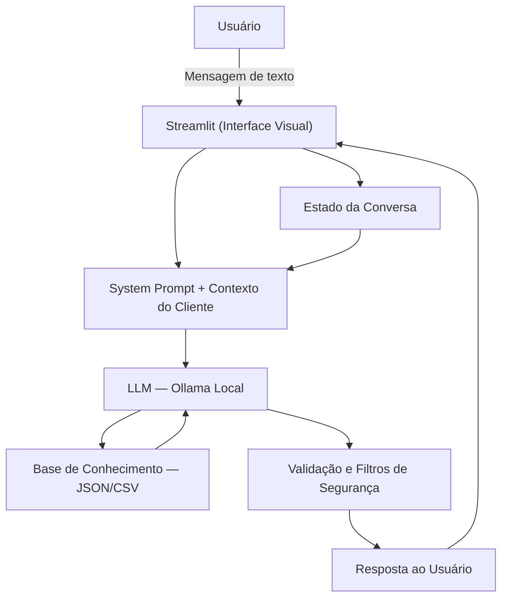

# 💰 Leofi - Assistente Financeiro Conversacional
 
> Agente de IA Generativa que auxilia na organização da vida financeira pessoal por meio de linguagem natural, simulações simples e explicações claras, mantendo contexto durante toda a conversa.
 
## 💡 O Que é o Leofi?
 
O Leofi é um assistente financeiro pessoal que **orienta, não decide**. Ele ajuda o usuário a entender melhor suas finanças através de explicações simples, simulações práticas e interações claras e seguras — funcionando como um guia no dia a dia financeiro, sem substituir profissionais ou recomendar investimentos.
 
**O que o Leofi faz:**
- ✅ Simula cálculos financeiros simples (metas, dívidas, parcelas)
- ✅ Ajuda no planejamento de metas financeiras
- ✅ Explica produtos financeiros de forma clara
- ✅ Compara cenários simples (parcelar vs guardar)
- ✅ Mantém contexto ao longo da conversa
**O que o Leofi NÃO faz:**
- ❌ Não recomenda investimentos específicos
- ❌ Não toma decisões pelo usuário
- ❌ Não solicita informações sensíveis
- ❌ Não acessa dados bancários reais
- ❌ Não substitui um consultor financeiro
---
 
## 🏗️ Arquitetura
 

 
**Stack:**
- Interface: [Streamlit](https://streamlit.io/)
- LLM: [Ollama](https://ollama.com/) (modelo local `llama3`)
- Dados: JSON/CSV mockados na pasta `data/`
---
 
## 📁 Estrutura do Projeto
 
```
├── data/                          # Base de conhecimento
│   ├── perfil_investidor.json     # Perfil, metas e objetivos do cliente
│   ├── dividas.json               # Dívidas ativas (cartão e empréstimo)
│   ├── despesas_fixas.json        # Despesas fixas mensais
│   ├── estado_conversa.json       # Contexto da sessão atual
│   ├── simulacoes_regras.json     # Fórmulas de juros e metas
│   ├── produtos_financeiros.json  # Catálogo de produtos financeiros
│   ├── historico_atendimento.csv  # Histórico de interações anteriores
│   └── transacoes.csv             # Histórico de transações recentes
│
├── docs/                          # Documentação completa
│   ├── 01-documentacao-agente.md  # Caso de uso, persona e arquitetura
│   ├── 02-base-conhecimento.md    # Estratégia de dados e integração
│   ├── 03-prompts.md              # System prompt, exemplos e edge cases
│   ├── 04-metricas.md             # Avaliação e resultados dos testes
│   └── 05-pitch.md                # Apresentação do projeto
│
├── src/
│   ├── app.py                     # Aplicação Streamlit
│   └── requirements.txt           # Dependências do projeto
│
└── assets/
    └── RoteiroLab.md              # Roteiro de referência do laboratório
```
 
---
 
## 🗄️ Base de Conhecimento
 
Os dados mockados na pasta `data/` alimentam o contexto do Leofi a cada conversa. Todos são fictícios e criados para fins de demonstração.
 
| Arquivo | Formato | Conteúdo |
|---------|---------|----------|
| `perfil_investidor.json` | JSON | Nome, idade, renda (R$ 5.000), perfil moderado, patrimônio, reserva atual e metas financeiras |
| `dividas.json` | JSON | Cartão de crédito (R$ 1.820,50, juros 13% a.m.) e empréstimo pessoal (8x R$ 320,00) |
| `despesas_fixas.json` | JSON | Despesas fixas mensais totalizando R$ 2.739,70 (moradia, alimentação, transporte, etc.) |
| `simulacoes_regras.json` | JSON | Fórmulas de juros simples, compostos, metas e parcelamentos usadas nas simulações |
| `estado_conversa.json` | JSON | Contexto da sessão atual: última intenção, valor mencionado, prazo e simulação |
| `produtos_financeiros.json` | JSON | Catálogo de produtos: Tesouro Selic, CDB, LCI/LCA, FII e Fundo de Ações |
| `historico_atendimento.csv` | CSV | Histórico de interações anteriores do cliente com o agente |
| `transacoes.csv` | CSV | Histórico de transações recentes (entradas e saídas por categoria) |
 
---
 
## 🚀 Como Executar
 
### 1. Instalar o Ollama e baixar o modelo
 
```bash
# Baixe o Ollama em: https://ollama.com
ollama pull llama3
ollama serve
```
 
> Você pode substituir `llama3` por qualquer outro modelo disponível no Ollama. Basta atualizar a variável `MODELO` no arquivo `src/app.py`.
 
### 2. Instalar as Dependências
 
```bash
pip install -r src/requirements.txt
```
 
### 3. Rodar o Leofi
 
```bash
streamlit run src/app.py
```
 
---
 
## 🎯 Exemplos de Uso
 
**Pergunta:** "Quanto tempo vou levar para completar minha reserva de emergência guardando R$ 500 por mês?"  
**Leofi:** "Sua reserva atual é de R$ 10.000 e a meta é R$ 15.000 — faltam R$ 5.000. Guardando R$ 500/mês, você chegaria lá em 10 meses, dentro do seu prazo de junho/2026! Quer que eu simule com outros valores?"
 
**Pergunta:** "Tenho dívidas no cartão e um empréstimo. Por qual devo começar a pagar?"  
**Leofi:** "O cartão de crédito tem juros de 13% ao mês — um dos mais altos do mercado. Ele cresce muito rápido e deve ser a prioridade. O empréstimo tem parcelas fixas e já está controlado. Quer que eu simule quanto o cartão vai custar se não for quitado nos próximos meses?"
 
**Pergunta:** "Onde devo investir meu dinheiro agora?"  
**Leofi:** "Não tenho como te dizer onde investir — isso é responsabilidade de um consultor certificado. Mas posso te explicar como cada produto funciona para você decidir com mais clareza. Quer que eu compare Tesouro Selic, CDB e LCI/LCA?"
 
---
 
## 📊 Métricas de Avaliação
 
| Métrica | Resultado (média 1–5) |
|---------|----------------------|
| **Assertividade** — O agente responde o que foi perguntado? | 4,5 |
| **Segurança** — Evita inventar informações (anti-alucinação)? | 4,3 |
| **Coerência** — A resposta é adequada ao perfil do cliente? | 4,8 |
| **Tom e linguagem** — Comunicação clara e empática? | 4,8 |
| **Utilidade** — O usuário sai com mais clareza sobre suas finanças? | 4,3 |
 
Avaliação conduzida com 4 participantes e 6 cenários de teste estruturados. Detalhes em [`docs/04-metricas.md`](./docs/04-metricas.md).
 
---
 
## 🎬 Diferenciais
 
- **Personalização real:** Usa os dados do próprio cliente (dívidas, despesas, metas) para contextualizar cada resposta
- **Margem calculada automaticamente:** O Leofi já sabe quanto o cliente tem disponível por mês antes de qualquer pergunta
- **100% local:** Roda com Ollama, sem enviar dados para APIs externas
- **Contexto conversacional:** Mantém o histórico da sessão para respostas mais inteligentes e encadeadas
- **Seguro por design:** Estratégias de anti-alucinação documentadas e testadas
---
 
## 📝 Documentação Completa
 
Toda a documentação técnica, estratégias de prompt e casos de teste estão disponíveis na pasta [`docs/`](./docs/).
 
| Documento | Conteúdo |
|-----------|----------|
| [`01-documentacao-agente.md`](./docs/01-documentacao-agente.md) | Caso de uso, persona e arquitetura |
| [`02-base-conhecimento.md`](./docs/02-base-conhecimento.md) | Dados utilizados e estratégia de integração |
| [`03-prompts.md`](./docs/03-prompts.md) | System prompt, exemplos e edge cases |
| [`04-metricas.md`](./docs/04-metricas.md) | Avaliação de qualidade e resultados |
| [`05-pitch.md`](./docs/05-pitch.md) | Apresentação do projeto |
 
---
 
> ⚠️ **Aviso:** O Leofi é um assistente educativo e não substitui um consultor financeiro certificado. Todos os dados utilizados são fictícios e criados para fins de demonstração.