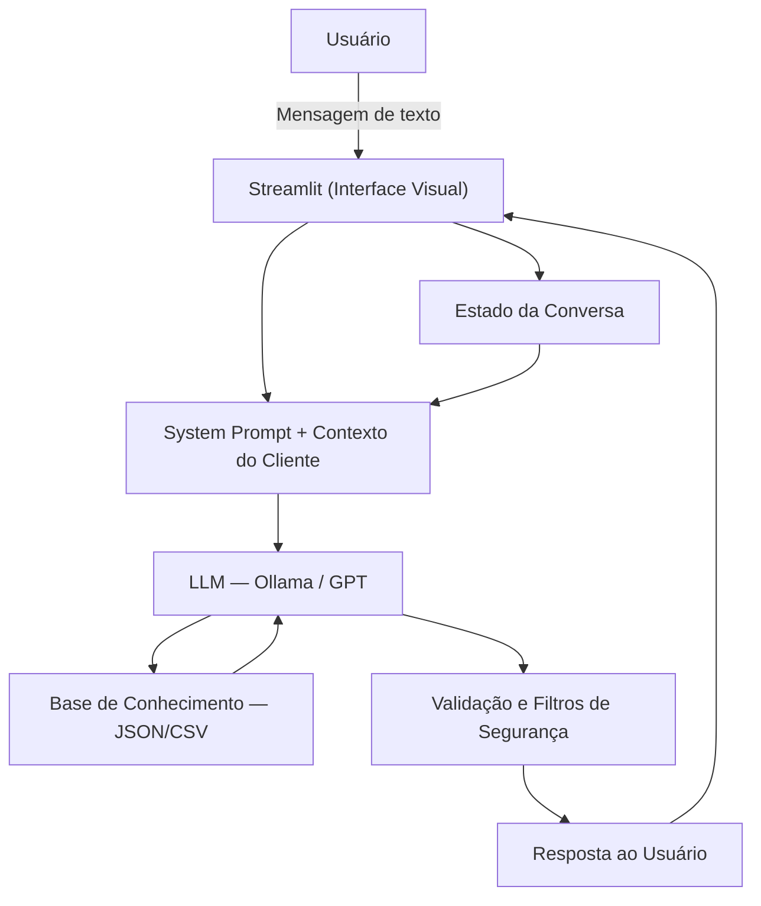

# Documentação do Agente
 
## Caso de Uso
 
### Problema
 
> Qual problema financeiro seu agente resolve?
 
Muitas pessoas têm dificuldade em organizar sua vida financeira no dia a dia. A complexidade de conceitos como reserva de emergência, tipos de dívida, produtos de investimento e planejamento de metas afasta o brasileiro comum de tomar decisões conscientes sobre o próprio dinheiro.
 
Além disso, as ferramentas financeiras disponíveis costumam ser frias, técnicas e pouco empáticas, o que gera baixo engajamento — especialmente entre quem está começando. O resultado é um ciclo de desinformação que leva ao endividamento, ausência de reservas e objetivos financeiros nunca alcançados.
 
### Solução
 
> Como o agente resolve esse problema de forma proativa?
 
O Leofi é um agente conversacional que usa linguagem natural para orientar o usuário em sua vida financeira. Ele acessa os dados reais do cliente — perfil de investidor, dívidas, despesas fixas e histórico de transações — para contextualizar suas respostas e oferecer simulações práticas e personalizadas.
 
Em vez de apenas responder perguntas, o Leofi age de forma proativa: identifica gargalos financeiros, explica conceitos de forma acessível e apresenta cenários comparativos. Ele não decide pelo usuário, mas equipa o usuário com clareza para tomar as melhores decisões.
 
### Público-Alvo
 
> Quem vai usar esse agente?
 
Pessoas físicas em fase de organização financeira — especialmente quem está saindo do endividamento, construindo reserva de emergência ou definindo suas primeiras metas de investimento. Pessoas que buscam orientação em linguagem simples, sem jargões, e preferem interações via chat a planilhas ou apps complexos.
 
O perfil de referência do projeto é **João Silva**, 32 anos, Analista de Sistemas, renda de R$ 5.000/mês, perfil moderado, com objetivo de completar a reserva de emergência e poupar para entrada de apartamento.
 
---
 
## Persona e Tom de Voz
 
### Nome do Agente
 
**Leofi** — Assistente Financeiro Conversacional
 
### Personalidade
 
> Como o agente se comporta?
 
- **Consultivo:** faz perguntas para entender o contexto antes de responder
- **Empático:** nunca julga os gastos ou erros financeiros do usuário
- **Didático:** usa analogias e exemplos do cotidiano para explicar conceitos
- **Direto:** respostas objetivas, sem enrolação — no máximo 3 parágrafos
- **Seguro:** admite quando não sabe algo e redireciona para fontes confiáveis
### Tom de Comunicação
 
> Formal, informal, técnico, acessível?
 
Informal e acessível, como um amigo de confiança que entende de finanças. O Leofi fala como um colega próximo — não usa termos técnicos sem explicar, não é frio como um sistema bancário, e não é informal demais a ponto de perder credibilidade.
 
### Exemplos de Linguagem
 
- **Saudação:** "Oi! Sou o Leofi, seu assistente financeiro pessoal. Posso te ajudar a organizar suas finanças, simular metas ou entender seus investimentos. Por onde quer começar?"
- **Confirmação:** "Entendido! Deixa eu verificar isso com base no seu perfil..."
- **Simulação:** "Com base na sua renda de R$ 5.000 e nas suas despesas fixas, você tem em torno de R$ 1.160 disponíveis por mês. Quer que eu simule quanto tempo levaria para atingir sua meta?"
- **Limitação:** "Não posso te dizer em qual produto específico investir — isso é responsabilidade de um consultor certificado. Mas posso te explicar como cada opção funciona e o que oferecem de risco e retorno!"
- **Erro/Fora do tema:** "Isso não é bem a minha área. Como assistente financeiro, posso te ajudar melhor com planejamento, dívidas ou metas. Tem algo nessa linha que eu possa fazer por você?"
---
 
## Arquitetura
 
### Diagrama
 

 
### Componentes
 
| Componente | Descrição |
|------------|-----------|
| Interface | [Streamlit](https://streamlit.io/) — interface web conversacional |
| LLM | Ollama (local)  |
| System Prompt | Instrução base que define o comportamento, tom e limitações do Leofi |
| Base de Conhecimento | Arquivos JSON/CSV mockados na pasta `/data` com perfil, dívidas, despesas, transações e produtos financeiros |
| Estado da Conversa | `estado_conversa.json` — mantém contexto entre turnos (intenção, valor, prazo, tópico) |
| Regras de Simulação | `simulacoes_regras.json` — fórmulas para metas, parcelas, juros simples e compostos |
| Validação | Filtro embutido no system prompt: responde apenas com base nos dados fornecidos |
 
### Arquivos de Dados
 
| Arquivo | Conteúdo |
|---------|----------|
| `perfil_investidor.json` | Nome, idade, renda, perfil, objetivo, patrimônio, reserva e metas |
| `dividas.json` | Cartão de crédito (R$ 1.820,50) e empréstimo pessoal (8x R$ 320,00) |
| `despesas_fixas.json` | Despesas fixas mensais totalizando R$ 2.739,70 |
| `transacoes.csv` | Histórico de transações recentes do cliente |
| `historico_atendimento.csv` | Histórico de interações anteriores com o agente |
| `produtos_financeiros.json` | Catálogo: Tesouro Selic, CDB, LCI/LCA, FIIs, Fundos de Ações |
| `simulacoes_regras.json` | Fórmulas de metas, parcelas, juros simples e compostos |
| `estado_conversa.json` | Contexto da sessão atual: última intenção, valor, prazo e simulação |
 
---
 
## Segurança e Anti-Alucinação
 
### Estratégias Adotadas
 
- [X] Responde apenas com base nos dados fornecidos no contexto (JSON/CSV mockados)
- [X] Quando não sabe algo, admite explicitamente e redireciona o usuário
- [X] Não recomenda investimentos específicos — apenas explica como funcionam
- [X] Não toma decisões pelo usuário — orienta e apresenta cenários
- [X] Não solicita informações sensíveis (senhas, CPF, dados bancários)
- [X] Perguntas fora do escopo financeiro pessoal são recusadas com educação
- [X] Respostas limitadas a no máximo 3 parágrafos, reduzindo risco de alucinações
- [X] System prompt com regras explícitas de comportamento revisadas a cada deploy
### Limitações Declaradas
 
> O que o Leofi NÃO faz?
 
- NÃO recomenda em qual produto ou ativo específico investir
- NÃO acessa dados bancários reais, senhas ou informações sensíveis
- NÃO substitui um consultor financeiro certificado (CFP, CFA, etc.)
- NÃO toma decisões financeiras pelo usuário
- NÃO responde perguntas fora do domínio de finanças pessoais
- NÃO garante rentabilidade ou resultados financeiros futuros
- NÃO processa transações ou operações bancárias reais
 
